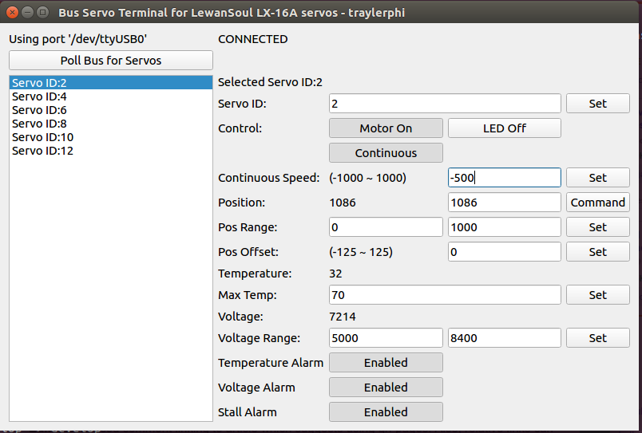

# lewansoul-lx-16a

GPLv3

# Who

Not really important - I guess check "Contributors" if this matters to you

# What

A very simple application implemented in PYQT5 for configuring LewanSoul LX-16A bus servos through USB.

Hopefully in a cross-platform way (I have no way to test on Windows), allows anyone with Python and PYQT5 to:

* Set Servo IDs (you should only have one "ID:1" on the bus at a time now!)
* Set LED state
* Set LED Error conditions
* Toggle Motor Power On/Off
* Command Servo Position (immediate, fastest move only - the servos have wait-for-signal and move duration capability, not currently implemented here)
* Command Continuous Rotation Speed
* Set Position Min/Max range and Offset Adjustment
* Set Over-voltage limit value
* Set Over-temp limit value
* Read Position, Voltage, Temperature feedback values

# Requirements

These are the commands I ran to install things I needed to make it work.

Already had python3.5 and pip installed.

There is a bug in PYQT5 version 5.11 that throws exceptions on my system. YMMV

Apologies this isn't more helpful - good luck :)
```
sudo -H pip3 install "pyqt5<5.11"
sudo -H pip3 install pyserial
```

# Why

The download on LewanSoul's website to configure my new servos doesn't play well with Linux.  In fact, can't load it through wine at all, although I don't blame wine.  To be fair, the installer and uninstaller work.
Not finding a linux version in my searches, at least nothing standalone, and I'll need to write most of what this program will do into my REAL project anyway, so why not build a PYQT5 version to share?
Also, I hope that putting this code out will help someone else if they want to create their own Python script for working with these servos through USB.

Looking back, this wasn't really that hard.  There were some minor gotcha's, like double checking the command packet length, and re-reading the docs until the minor piece I missed popped out (I got the checksum calculation wrong through several attempts).

Worthy of note: if you send a bad command down the bus, absolutely nothing happens, which can give the impression that your serial port is not configured correctly.  If you're getting nothing back, there is probably something wrong with the command - this doesn't require anything fancy, I used 115200 buad rate with a 100ms timeout - all the other settings are whatever the defaults are (for those not using Python - it's 115200 8N1)

# Latest Screenshot



# Updates

###### August 29th, 2018

* Added a check to see if the debug baord is even plugged in, to prevent nasty exceptions if not
* Implemented Angle Offset Adjustments and Servo/Continuous mode
* As I was adding the new commands, I found I was getting garbage results for everything all of a sudden. Apparently if you don't ctach the response or flush the buffers, all hell breaks lose.  Also, kinda of crappy that every little method was implementing a response parse, so this has been consolidated into a single sendCommand() method which replaces prepareCommand()+send+parse.  This new parsing strips out the header 0x55's, so what was previously response[5] is now result[3].
* Now _absolutely_ planning to break this into two classes: a standalone class for controlling the bus, and another to implement the GUI

###### August 7th, 2018

Almost all commands in the documentation are implemented.

The code's a little ugly, I'm not gonna front.  Could use a little clean up.  This is my first PYQT5 project, and I went for path of easiest results. At the end of the day, this is a setup tool for another project and what really matters is that it does it's job. I imagine breaking the read/writes to the servo bus into a separate class, maybe framework the UI elements a little.

Missing:
* Timing of Servo Position movements (this is intended as a setup tool, no real desire for this at the moment)
* Wait for 'GO' Servo Position commands (this is intended as a setup tool, no real desire for this at the moment)
* Angle Offset Adjustments (will probably want this at some point)
* Toggle between Servo/Continious motion modes (will definitely want this at some point, although I personally have little interest)


